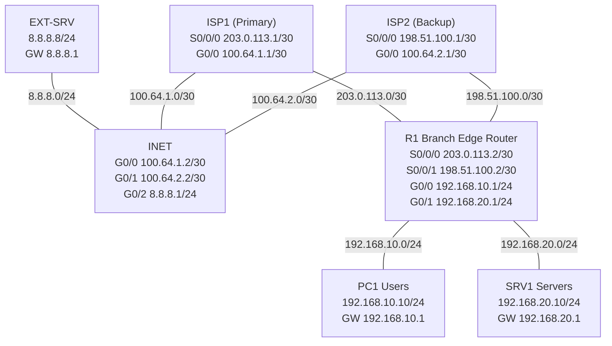

# CCNA Project 05 – Branch WAN Redundancy with Primary/Backup ISP Failover

## Overview
This project simulates a small branch office with dual WAN connectivity in Cisco Packet Tracer. The branch edge router uses a **primary ISP** for normal outbound traffic and a **backup ISP** for failover. The design uses **floating static routes** so that when the primary WAN path fails, traffic automatically shifts to the backup path.

The goal of this project was to understand the operational behavior of WAN failover, validate route preference changes, and document failure testing in a way that reflects entry-level NOC troubleshooting and monitoring work.

## Objectives
- Build a branch WAN topology with **dual ISP connectivity**
- Configure **primary and backup default routes**
- Validate **baseline connectivity**
- Simulate **primary WAN failure** and confirm failover to backup ISP
- Simulate **primary WAN restoration** and confirm failback
- Simulate **backup WAN failure while primary is healthy**
- Document routing behavior, testing results, and troubleshooting findings

## Topology Summary
<project05-network-topology screenshot here>

The topology consists of:
- **R1** as the branch edge router
- **ISP1** as the primary WAN provider
- **ISP2** as the backup WAN provider
- **INET** as the simulated upstream internet router
- **EXT-SRV** as the external reachable server
- **PC1** and **SRV1** as internal branch endpoints

### Logical Flow

- Normal path: `Branch -> R1 -> ISP1 -> INET -> EXT-SRV`
- Failover path: `Branch -> R1 -> ISP2 -> INET -> EXT-SRV`

## Topology Diagram
See: `topology/project05-topology.png`

## IP Addressing Plan

| Device | Interface | IP Address | Subnet Mask | Purpose |
|---|---|---:|---:|---|
| R1 | G0/0 | 192.168.10.1 | 255.255.255.0 | PC1 LAN gateway |
| R1 | G0/1 | 192.168.20.1 | 255.255.255.0 | SRV1 LAN gateway |
| R1 | S0/0/0 | 203.0.113.2 | 255.255.255.252 | Primary WAN to ISP1 |
| R1 | S0/0/1 | 198.51.100.2 | 255.255.255.252 | Backup WAN to ISP2 |
| ISP1 | S0/0/0 | 203.0.113.1 | 255.255.255.252 | To R1 |
| ISP1 | G0/0 | 100.64.1.1 | 255.255.255.252 | To INET |
| ISP2 | S0/0/1 | 198.51.100.1 | 255.255.255.252 | To R1 |
| ISP2 | G0/1 | 100.64.2.1 | 255.255.255.252 | To INET |
| INET | G0/0 | 100.64.1.2 | 255.255.255.252 | To ISP1 |
| INET | G0/1 | 100.64.2.2 | 255.255.255.252 | To ISP2 |
| INET | G0/2 | 8.8.8.1 | 255.255.255.0 | External network gateway |
| PC1 | FastEthernet0 | 192.168.10.10 | 255.255.255.0 | User endpoint |
| SRV1 | FastEthernet0 | 192.168.20.10 | 255.255.255.0 | Internal server endpoint |
| EXT-SRV | FastEthernet0 | 8.8.8.8 | 255.255.255.0 | External reachable server |

## Routing Design

## R1 Default Route Logic
R1 uses:
- **Primary static default route** via ISP1
- **Floating static backup default route** via ISP2 with higher administrative distance

### Example
- Primary route: `ip route 0.0.0.0 0.0.0.0 203.0.113.1`
- Backup route: `ip route 0.0.0.0 0.0.0.0 198.51.100.1 10`

This causes R1 to prefer ISP1 while it is available. If the primary path is lost, the backup route becomes active.

## Upstream Return Routing
Static routes were also configured on ISP1, ISP2, and INET so that return traffic could reach:
- branch LAN networks
- branch WAN /30 networks

This was important for successful validation of both:
- host-originated traffic
- router-originated traffic

## Validation Scope
The following validation scenarios were performed:
1. **Baseline validation** with ISP1 active
2. **Primary WAN failure test** to validate failover to ISP2
3. **Primary WAN restoration test** to validate failback to ISP1
4. **Backup WAN failure test** while primary remains healthy

Detailed results are documented in the `validation/` folder.

## Key Commands Used
- `show ip interface brief`
- `show ip route`
- `ping`
- `traceroute`
- `show controllers serial`
- `show running-config`

## Technical Findings
- Floating static routes provided a simple and effective failover mechanism for this topology.
- End-to-end validation required not only default routing, but also correct **return-path routing** on upstream devices.
- Router-originated traffic initially failed because the INET router did not have routes for the branch WAN /30 subnets.
- Adding static routes for `203.0.113.0/30` and `198.51.100.0/30` on INET resolved the issue.

## Limitations
This project uses **floating static routes**, which mainly handle direct path failure. In a real production environment, a more advanced design could use:
- **IP SLA**
- **object tracking**
- dynamic routing with provider edge integration

That would allow failover decisions based on upstream reachability instead of only direct link state.

## Skills Demonstrated
- Static routing
- Floating static routes
- WAN path preference
- Failover and failback testing
- Routing table interpretation
- Return-path troubleshooting
- Lab documentation and structured validation
